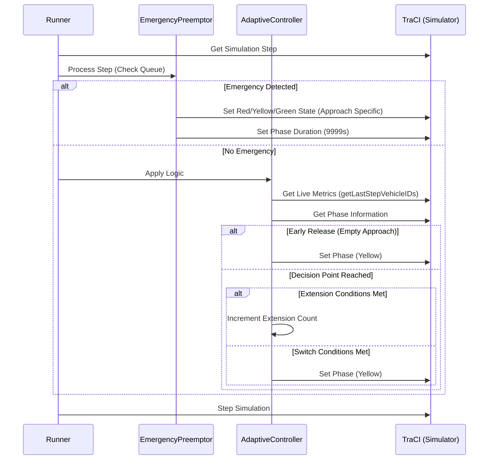

# Traffic Signal Control Algorithm

This document explains the logic behind the adaptive traffic signal control system used in this project. The system combines real-time demand estimation with dynamic green extensions and emergency vehicle preemption.

## 1. Demand Estimation (PCU Density)

The algorithm uses **Passenger Car Unit (PCU)** to estimate the true demand of an approach. Instead of simply counting vehicles, it weights them based on their size and impact on traffic flow.

### PCU Weight Mapping
| Vehicle Class | PCU Weight |
| :--- | :--- |
| Hatchback, Sedan, SUV, MUV, LCV, Van | 1.0 |
| Bus, Truck, Mini-bus, Tempo-traveller | 3.0 |
| Three-wheeler | 0.7 |
| Two-wheeler, Bicycle | 0.5 |
| Others / Unknown | 1.0 |

### Density Calculation
For each approach (e.g., North, South), the total PCU is calculated as:
$$PCU_{approach} = \sum_{i \in Vehicles} Weight(Class_i)$$

Approaches are paired to match typical intersection phases:
- **NS_PCU** = $PCU_{North\_In} + PCU_{South\_In}$
- **EW_PCU** = $PCU_{East\_In} + PCU_{West\_In}$

---

## 2. Adaptive Logic Flow

The controller manages a standard 6-phase cycle but dynamically adjusts the duration of Green phases.

### Phase Definitions
- **Phase 0:** North-South Green
- **Phase 1:** North-South Yellow
- **Phase 2:** All Red
- **Phase 3:** East-West Green
- **Phase 4:** East-West     Yellow
- **Phase 5:** All Red

### Decision Logic Flowchart
```mermaid
flowchart TD
    A[Start Simulation Step] --> B{Emergency Preemption Active?}
    B -- Yes --> C{Vehicle Passed?}
    C -- Yes --> D[Release Preemption & Reset Timer]
    C -- No --> E[Maintain Emergency Green]
    
    B -- No --> F{New Emergency Vehicle Nearby?}
    F -- Yes --> G[Activate Preemption for Approach]
    F -- No --> H[Run Adaptive Controller]

    H --> I{Current Phase in Transition [Y/R]?}
    I -- Yes --> J[Wait for Transition to Complete]
    I -- No --> K{Approach Empty & Opposing Demand?}
    
    K -- Yes --> L[Early Switch to Yellow]
    K -- No --> M{Elapsed Time >= Threshold?}
    
    M -- Yes --> N{Current Demand > Opposing & Extensions < Limit?}
    N -- Yes --> O[Extend Green by 15s]
    N -- No --> P{Opposing Demand > 0?}
    P -- Yes --> Q[Switch to Yellow]
    P -- No --> R[Maintain Green]
    
    M -- No --> S[Maintain Green]
```

---

## 3. Key Parameters

The algorithm behavior is governed by these default values (defined in `simulation/core/config.py`):

| Parameter | Default Value | Description |
| :--- | :--- | :--- |
| `base_green` | 15.0 s | The initial green time granted to a phase. |
| `extend_green` | 15.0 s | **Extension Period**: The duration added per extension. |
| `extend_n_times` | 3 | Maximum number of extensions allowed before a forced switch. |
| `min_green` | 5.0 s | Minimum green time (used for safety/system defaults). |
| `max_green` | 60.0 s | Absolute cap on green duration. |

**Effective Green Time Calculation:**
$$Threshold = BaseGreen + (ExtensionCount \times ExtensionPeriod)$$

---

## 4. Sequence Diagram

This diagram shows the interaction between the simulation runner and the logic modules during a single step.



---

## 5. Optimization Features

1.  **Early Release**: If a green approach becomes completely empty (`PCU = 0`) but the opposing approach has vehicles waiting, the controller immediately triggers a transition to Yellow, saving idle time.
2.  **Preemption Recovery**: When an emergency vehicle passes, the `AdaptiveController` immediately switches to the phase with the highest accumulated demand to clear the backlog created during preemption.
3.  **Transition Safety**: The algorithm never interrupts a Yellow (3s) or All-Red (2s) phase, ensuring driver safety and compliance with SUMO's internal state machine.
