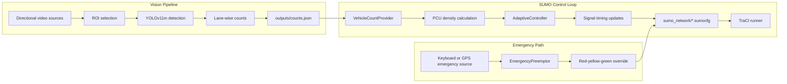
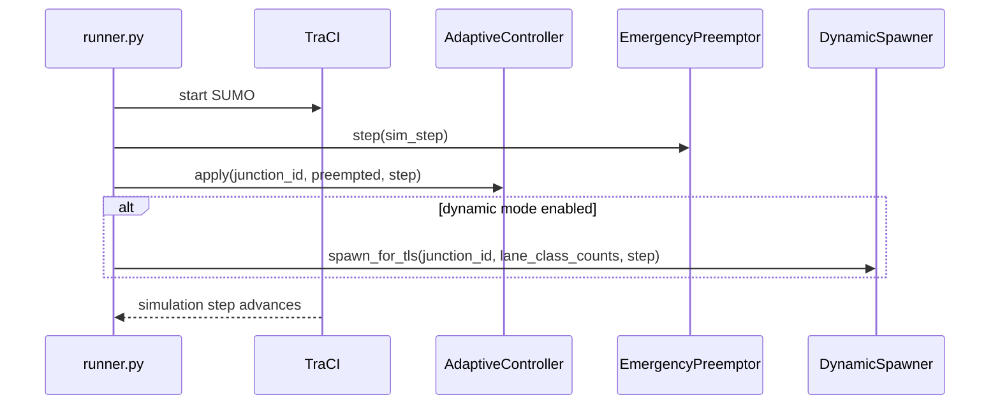

# Vision Based Adaptive Traffic Control with GPS Emergency Preemption


An adaptive traffic management system that combines computer vision, SUMO/TraCI simulation, and emergency preemption logic to replace fixed-time signal control with real-time, demand-aware signal allocation.

## Overview

The repository is split into two operational modules:

1. The vision pipeline reads directional traffic videos, applies ROI masking, runs YOLOv11m inference, and exports lane counts to JSON.
2. The SUMO control loop reads demand, computes PCU-based density, adapts green time, and applies emergency vehicle preemption when an emergency is queued.

The current codebase is designed around a single four-leg junction and supports both static SUMO demand and optional Python-driven dynamic spawning.

## Problem Statement

Traditional signal plans stay fixed even when traffic demand changes minute by minute. That leads to unnecessary delay, inefficient green allocation, higher fuel use, worse congestion, and slow emergency response.

This project addresses those problems by:

- Estimating traffic demand from live video.
- Adapting signal timing using lane-wise density.
- Prioritizing emergency vehicles through signal preemption.
- Keeping the vision and simulation layers loosely coupled so they can be reused or replaced independently.

## Features

- Real-time vehicle detection with Ultralytics YOLOv11m.
- ROI-based filtering to ignore irrelevant image regions.
- Multi-direction vehicle counting for north, south, east, and west approaches.
- JSON export of the latest counts to `outputs/counts.json`.
- PCU-weighted adaptive signal control in SUMO.
- Early release when a green approach becomes empty.
- Optional green extensions when current demand remains higher than the opposing phase.
- Emergency vehicle preemption with a dedicated `emergency` vehicle type.
- Optional dynamic spawning of vehicles into SUMO from lane/class counts.
- GUI overlays for live density inspection in SUMO-GUI.
- Edge deployment experimentation on NVIDIA Jetson Nano.

## System Architecture



The core control path is implemented in `simulation/runner.py`, with adaptive timing in `simulation/logic/adaptive.py`, emergency handling in `simulation/logic/preemption.py`, and optional dynamic demand injection in `simulation/logic/spawner.py`.

## Dataset Information

The project was developed around the UVH-26 traffic dataset from the Indian Institute of Science, Bangalore.

- 26,646 traffic images.
- Approximately 2,800 Bengaluru Safe City CCTV cameras.
- Around four weeks of collection.
- Roughly 1.8 million annotations.
- Indian urban traffic conditions and vehicle mix.

Vehicle classes used in the project context:

- Hatchback
- Sedan
- SUV
- MUV
- Bus
- Truck
- Three Wheeler
- Two Wheeler
- LCV
- Minibus
- Tempo Traveller
- Bicycle
- Van
- Other Vehicles

## Model Training Details

The repository uses Ultralytics YOLO for training and inference, with `yolo11m.pt` configured as the default weight file in `vision/config.py`.

- Training strategy: transfer learning and fine-tuning from pretrained YOLOv11m weights.
- Framework: Ultralytics YOLO.
- Environment: Python and Jupyter Notebook.
- Hardware used for training: NVIDIA TITAN GPU with about 1 TB of storage.
- Model selection: YOLO family and RT-DETR variants were evaluated, and YOLOv11m was selected for the best speed-accuracy tradeoff.
- Label inspection helper: `vision/check_classes.py` prints the class mapping from the loaded YOLO weights.

This repository contains the inference and integration code. The training notebook or dataset pipeline is not bundled here, so the fine-tuned weights should be supplied separately and placed at the path expected by the vision configuration.

## Performance Metrics

Reported detection and runtime performance:

| Metric | Value |
| --- | --- |
| mAP@50 | 69.9% |
| mAP@50-95 | 61.3% |
| Precision | 66.8% |
| Recall | 67.4% |
| Inference time | 6.2 ms |
| Total processing time | about 11 ms |

Edge deployment result on NVIDIA Jetson Nano:

| Metric | Value |
| --- | --- |
| Deployment status | Successful |
| Approximate inference speed | 0.2 FPS |
| Observation | Further optimization is required for fully real-time edge execution |

## Tech Stack

- Python
- OpenCV
- NumPy
- Ultralytics YOLO
- SUMO
- TraCI
- Jupyter Notebook
- NVIDIA CUDA-compatible GPU training setup
- NVIDIA Jetson Nano edge target

## Installation

Install the Python dependencies listed in the repository:

```bash
python -m venv .venv
pip install -r requirements.txt
```

Before running SUMO-based workflows, make sure SUMO is installed and `SUMO_HOME` is set in your environment.

## Environment Setup

The code expects the following paths and assets:

- YOLO weights at `models/yolo11m.pt`.
- Directional input videos under `assets/videos/`.
- Generated outputs under `outputs/`.
- SUMO assets under `sumo_network/`.

Useful configuration files:

- `vision/config.py`
- `simulation/core/config.py`
- `sumo_network/single_junction.sumocfg`
- `sumo_network/single_junction_dynamic.sumocfg`

## Dataset Preparation

For inference and testing, place directional videos in the folder discovered by `vision/utils.py`.

- Filenames should start with `north_`, `south_`, `east_`, or `west_` so the pipeline can map them to approaches.
- The first frame of each video is used for ROI selection.
- The ROI is drawn interactively and later reused during inference.

For training, prepare UVH-26 annotations in the format required by Ultralytics YOLO and fine-tune the pretrained YOLOv11m weights before exporting the final model to `models/yolo11m.pt`.

## Training Instructions

The repository does not ship a training script, but the intended training workflow is:

1. Start from pretrained YOLOv11m weights.
2. Fine-tune on the UVH-26 dataset.
3. Verify the resulting class mapping with `python -m vision.check_classes`.
4. Save the trained weights as `models/yolo11m.pt`.
5. Re-run validation until the label set matches the expected vehicle classes used by the vision and simulation layers.

## Inference Instructions

### Vision Pipeline

Run the video-based detection pipeline to generate counts and annotated previews:

```bash
python -m vision.pipeline
```

This writes the latest direction totals to `outputs/counts.json` and keeps the on-screen grid synchronized with the current counts.

### SUMO Simulation

Run the traffic simulation and adaptive controller:

```bash
python -m simulation.runner
```

Supported flags from the repository code:

- `--gui` launches `sumo-gui` instead of headless SUMO.
- `--config` selects the SUMO configuration file in static XML mode.
- `--dynamic` enables Python-driven dynamic spawning.
- `--yolo` enables the initial YOLO-based demand snapshot and also activates dynamic spawning.

Example dynamic run:

```bash
python -m simulation.runner --gui --dynamic
```

When dynamic mode is enabled, the runner switches to `sumo_network/single_junction_dynamic.sumocfg`.

## SUMO Integration Setup

The SUMO integration is built around the following files:

- `sumo_network/single_junction.net.xml`
- `sumo_network/single_junction.rou.xml`
- `sumo_network/single_junction.sumocfg`
- `sumo_network/single_junction_dynamic.rou.xml`
- `sumo_network/single_junction_dynamic.sumocfg`

Static mode uses the XML routes defined in `single_junction.rou.xml`. Dynamic mode uses `DynamicSpawner` to inject vehicles into SUMO at runtime through TraCI.



## Jetson Nano Deployment

The project was evaluated on NVIDIA Jetson Nano to gauge edge feasibility.

- Vehicle detection executed successfully on the device.
- Observed throughput was about 0.2 FPS.
- The result shows the architecture is portable to edge hardware, but more optimization is needed for true real-time operation.

Recommended deployment direction:

- Reduce model cost or export to a more efficient runtime.
- Keep ROI selection tight to limit per-frame work.
- Limit display and GUI overhead on-device.

## Emergency Vehicle Preemption Workflow

The current runnable emergency path is implemented in `simulation/runner.py` and `simulation/logic/preemption.py`.

1. An emergency trigger is received by the terminal listener in the runner.
2. The runner creates an emergency vehicle in SUMO and adds it to the preemption queue.
3. `EmergencyPreemptor.step()` checks the queue each simulation tick.
4. When a vehicle is active, the controller forces the junction into a preemptive state using TraCI signal overrides.
5. Preemption remains active until the emergency vehicle enters an outgoing edge.
6. The preemptor restores the normal program and the adaptive controller resumes phase control.

The repository also includes `simulation/core/gps.py` for simulating GPS lag, noise, and dropout, which can be used as the basis for a GPS-fed emergency detector if you want to wire that source into the same preemption queue.

## Results

What the repository produces today:

- `outputs/counts.json` keeps the latest direction totals in a compact JSON format.
- `outputs/yolo_initial_detection.jpg` captures the verification grid from the initial YOLO pass.
- SUMO-GUI overlays can show live PCU and class breakdowns per approach.
- The adaptive controller supports empty-approach early release, green extensions, and emergency override in a live simulation.

## Project Structure

```text
miniproject/
├── ALGORITHM.md
├── GEMINI.md
├── README.md
├── backups/
│   ├── adaptive_traffic.py
│   ├── adaptive_traffic_traci_bridge.py
│   ├── main.py
│   ├── runs/
│   │   └── detect/
│   │       └── predict/
│   └── traffic.jpg
├── outputs/
│   ├── counts.json
│   └── yolo_initial_detection.jpg
├── plan.md
├── requirements.txt
├── simulation/
│   ├── __init__.py
│   ├── reference.py
│   ├── runner.py
│   ├── core/
│   │   ├── __init__.py
│   │   ├── config.py
│   │   ├── gps.py
│   │   └── utils.py
│   ├── interfaces/
│   │   ├── __init__.py
│   │   ├── count_provider.py
│   │   └── providers.py
│   └── logic/
│       ├── __init__.py
│       ├── adaptive.py
│       ├── diagnostics.py
│       ├── gui_overlay.py
│       ├── preemption.py
│       └── spawner.py
├── sumo_network/
│   ├── additional.add.xml
│   ├── edges.edg.xml
│   ├── grid.net.xml
│   ├── gui-settings.xml
│   ├── nodes.nod.xml
│   ├── routes.rou.xml
│   ├── simulation.sumocfg
│   ├── single_junction.net.xml
│   ├── single_junction.rou.xml
│   ├── single_junction.sumocfg
│   ├── single_junction_dynamic.rou.xml
│   └── single_junction_dynamic.sumocfg
└── vision/
    ├── __init__.py
    ├── check_classes.py
    ├── config.py
    ├── detector.py
    ├── exporter.py
    ├── pipeline.py
    ├── README.md
    ├── single_frame.py
    └── utils.py
```

Note: `models/` and `assets/videos/` are expected at runtime by the code, but they are not committed in this repository snapshot.

## Configuration

### Vision Configuration

Defined in `vision/config.py`:

- `MODEL_WEIGHTS = "yolo11m.pt"`
- `ASSETS_DIR = "assets/videos"`
- `OUTPUTS_DIR = "outputs"`
- `EXPORT_FILE = "outputs/counts.json"`
- `TARGET_FPS = 0.1`

### Simulation Configuration

Defined in `simulation/core/config.py`:

- `sumo_cfg = "your_network.sumocfg"`
- `dynamic_sumo_cfg = "sumo_network/single_junction_dynamic.sumocfg"`
- `demand_source = "static_xml"`
- `spawn_provider_mode = "hardcoded"`
- `spawn_interval_s = 100.0`
- `spawn_max_per_class_per_lane = 10`
- `base_green = 15.0`
- `extend_green = 15.0`
- `extend_n_times = 3`
- `preemption_green_duration = 30.0`
- `junction_id = "junction"`
- `approaches = ["north_in", "south_in", "east_in", "west_in"]`

The same config file also defines the vehicle class list, PCU weights, SUMO vClass mapping, and GPS noise parameters.

## Future Improvements

- Integrate the GPS helper into a live emergency vehicle detector.
- Add a reproducible training notebook or script for YOLOv11m fine-tuning.
- Expose more runtime options for demand source selection and spawn safety caps.
- Expand the simulation beyond a single junction.
- Optimize the edge path for Jetson Nano deployment.
